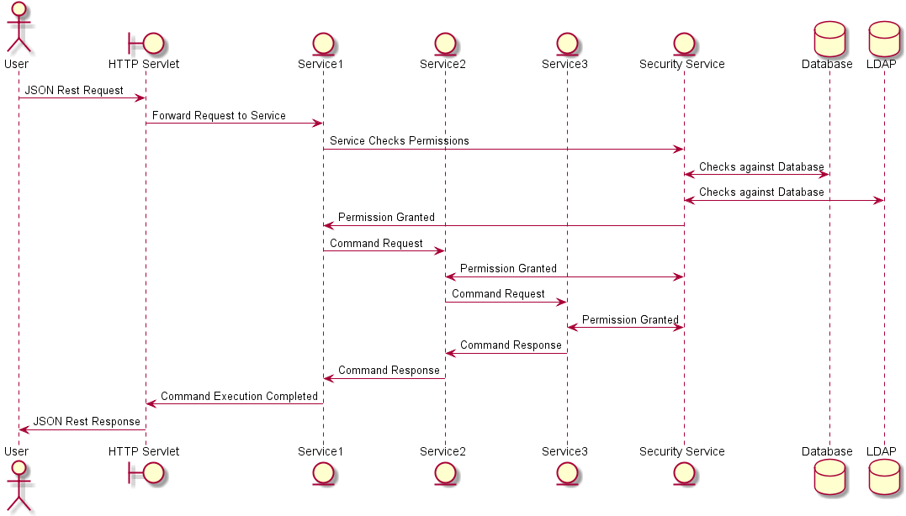

# Security Module Cluster Support
In a highly distributed enviornment, not only do you need to have an idea of the users session when a request is made, but that session needs to exist throughout the entire lifecycle of the executed command.

Here is an example of what a successful command looks like that his multiple services across a cluster.

In every communication from one service to another, there is an optional check for this authentication. What is passed internally is called the session Id.

The SessionID is just a randonly generated key that is only used internally and is never provided to the user or displayed in any way.

## Scalability
To partition the data and caching, it uses the users sessionId and/or tenant, and integration with the load balancer in the Message API to route all security checks too the correct instance.

This means that the caching for a user will be located on one machine. The location of the user session will be sharded based on the sessionID. This is used to auto direct user information and session requests to the 
correct Sercurity Service instance.

## Failover
There should always be multiple instances running. If a Security Service fails, those people on that machine get redirected to a machine they have no session with and the active session gets redirected to the new server.

There is a chance that the user may be required to reauthenticate based on the cause of the failure.