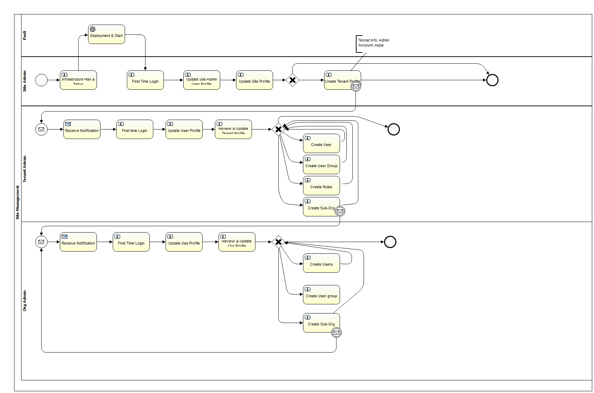

# User Roles and Responsibilities

## User Flow
Process flow for all key user roles and how the interaction occurs from the creation of a site, to the runtime of a user.

### User Role Definitions

Definition of different users involved in the use and management of Security. A User could have one or more roles within the system. Often the Administrator will also have the Support Roles.

#### PaaS

Platform level access to the cluster, for physically administrating the machines in the cluter.

##### PaaS/System Administrator

Root Access to Physical Servers
#### Site

In charge of Site level actions to monitor and configure the tenants within the installation.

##### Site Administrator
 * Configure Site Settings
 * Manage Cluster and Servers
 * Manage Applications
 * Create Site User Accounts
 
##### Site Support
 * Manage Site User Accounts
 * Manage Sub-Domains
 * Manage Sub-Domain Users
 * Monitor Cluster and Servers

##### Site Billing
 * Monitor Sub-Domains
 * Sub-Domain Reporting

#### Sub-Domain / Tenant
The root admin user for one of our customers in charge of configuring their installed applications, and administrating their organizations.
##### Sub-Domain Administrator
 * Configure Sub-Domain Settings
 * Configure Application Settings
 * Create Sub-Domain Administrators

##### Sub-Domain Support
 * Manage Users
 * Manage User Groups

#### Organization
The user who is in charge of a single organization, from managing its settings and configurations, to administrating its own users.

##### Organization Administrator
 * Configure Organization Settings
 * Create Organization Administrators

#####Organization Support
 * Manage Organization Users
####User
A general user who can sign in and use the applications installed in the system. They can edit and manage themselves.

##### User Group Support
 * Add Remove Users to User Groups

##### User
 * Configure Their User Settings
 * Login / Logout