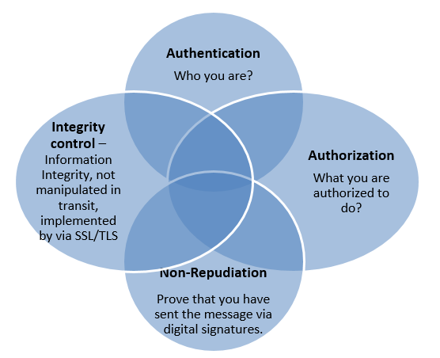

# Shared Security \ Security Federation

## What is Shared Security?

Shared Security \ Security Federation is the backbone of any distributed system.

### What is the difference between SSO and Federation?

  * SSO allows for a user to use the same credentials to log into two separate systems, but require the user to sign in
  from one system to another.
  
  * Federation is SSO, but does not require the user to reauthenticate between systems.
   
"With Enterprise SSO (ESSO), you get into the amusement park but still need a ticket for each ride (think Santa Cruz
Beach Boardwalk).  With federation, you get into the amusement park but have a wristband that every ride operator
recognizes and lets you on (think Disneyland)."
- [source](http://blog.empowerid.com/blog-1/bid/164625/What-is-federation-And-how-is-it-different-from-SSO)

### Why Do We Need Shared Security?

There are needs for both our highly distributed systems, and for our single instance stand along applications.

### Distributed System

A distributed system consists of many products, services and machines that have been built by a variety of product teams
and bought/borrowed from third parties. Given a very simple example of our web projects, if we want to give a seem-less
experience when a user clicks between TM, XES Monitor Portal, TestM, Financial, etc... we need to provide a single
login page and federate the users login across the application suite.

This also lets us manage security from within our highly scalable distributed processing systems so that at any point
the users request and information can be viewed or audited for authentication/authorization and data filtering.

### Single Instance

Currently with Edifecs, we do not have a Security component that is stand alone and can be easily reused across multiple
products. Many are tightly integrated in with the specific products. Every one of our products require security, and
wind up re-implementing security for each product wasting resources.

Also in the future you have the ability to quickly embed or include you application into a much bigger Edifecs cloud
Infrastructure.

## How Do We Solve It?
  
Central esm-service that acts as a central authentication and authorization system that exposes API's to work and
validate the users session information.

This is done through providing a set of commands from the esm-service through rest and using the message api. On top of
this plugins for existing Security frameworks can be written to interact with this central service easily. For Example,
a Apache Shiro or Spring Security plugin.

### What are the Principles of Security?

These principles must be followed at all times and all layers in the application to ensure a secure system.

### How does Security Manager Help Solve These Problems?

We have tools and components to address every aspect of security. For more information click on the section header below.
  
#### [User Roles](docs/userRole.md)

To manage the security in the cluster, there are some specific users who interact with the security module.
  
#### [Authentication](docs/authentication.md)

To authenticate a user we have multiple types of Authentication Tokens that allow the use of the basic username and
password to certificate based authentication. In the future we will also be adding in concepts such as two factor
authentication.
  
We also provide the ability for a tenant to configure his own third party authentication and authorization providers to
hook into systems like LDAP.

#### [Cluster Support](docs/cluster_support.md)

In a highly distributed environment, not only do you need to have an idea of the users session when a request is made,
but that session needs to exist throughout the entire lifecycle of the executed command.

#### [Caching](docs/caching.md)

How can we limit the number of calls made to our own esm-service, and to third party LDAP or Active Directory servers,
to improve overall system performance?

#### [Permission and Role Model](docs/roles_and_permissions.md)

How do we work with and manage the roles and permissions.
  
#### [Multitenancy](docs/multitenancy.md)
  
Support for multiple tenants within the same environment.
  
#### [User Interface - Login and Security Management](docs/userInterface.md)

Provides both the login page and management UI for user management.

#### [ProfileAttributes/FlexFields Integration](../flexfields/README.md)

As part of an application manifest file, profile attributes can be configured for a entity in ESM (User, Tenant, etc..).
This is integrated into the flex field service to provide the configurable options within the ESM profile pages.

#### [ISC Command Integration](docs/command.md)

Integration into the Message API to add security to the Command Handlers.
  
#### [Test Strategy](docs/testStrategy.md)

To support test driven development, a test strategy is critical for security.

#### [ECM PaaS/IaaS Integration](docs/ecm_integration.md)

## Deployment

  * [Deployment through ECM](docs/configuration_ecm.md)

  * [Local Install Configuration of ESM](docs/configuration_sm.md)

# Additional Reference Links

  * [http://msdn.microsoft.com/en-us/library/ms730908\(v=vs.110\).aspx](http://msdn.microsoft.com/en-us/library/ms730908\(v=vs.110\).aspx)
  
  * [http://www.infoq.com/presentations/api-security-federation-patterns](http://www.infoq.com/presentations/api-security-federation-patterns)
  
  * [https://www.pingidentity.com/products/pingfederate/](https://www.pingidentity.com/products/pingfederate/)