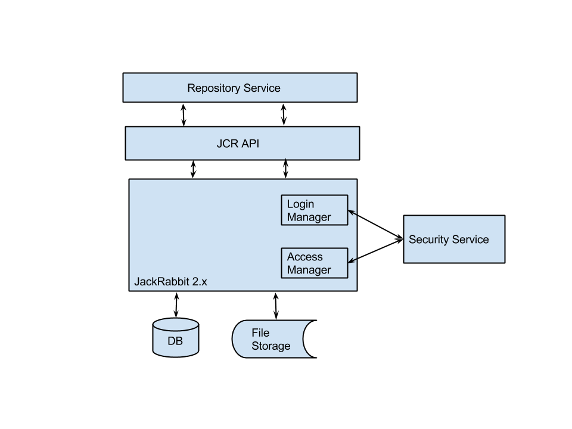
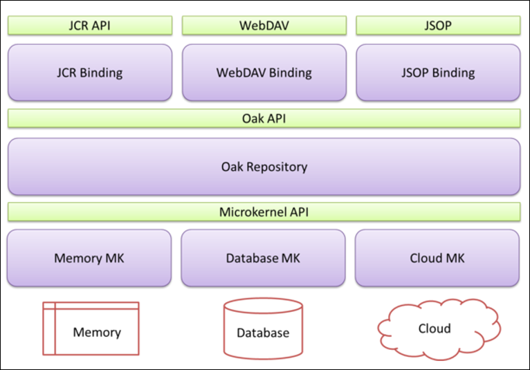
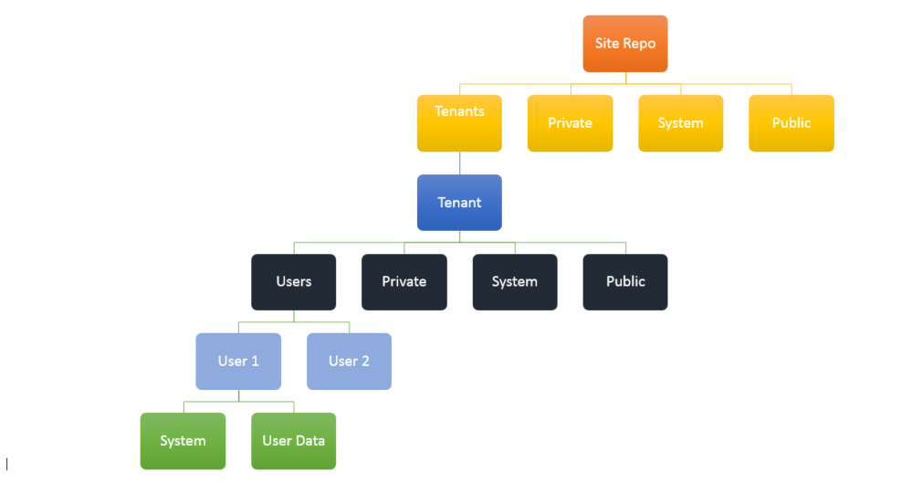

#Content Repository Module

Content repository module is yet another module to provide storage for unstructured and semi-structured data. Currently, it based upon tree like hierarchical structure with nodes and properties based upon Java Content Repository JCR 283 standard. All JCR implementations strictly follow JCR specifications and differ from each other in terms of other additional features they provide.

##Scalable and Fault Tolerance Repository
High scalable and fault tolerable module will use No SQL/Big Data technologies and we have following options:
 
###Option #1
Extend JCR 2.x with implementing own File Store and Persistent manager. Large blob data will be stored into the File store and node/properties information will be kept in HBase table as persistent manager.
1.	HDFS as File Store
2.	HBase as Persistent Manager – (Currenctly, NoSQL does not support transactions)
 
Some work is already done as PoC as sandbox project to use HDFS and HBase for file and persistent manager.
https://svn.eu.apache.org/repos/asf/jackrabbit/sandbox/jackrabbit-hadoop/
 
###Option #2
We can use combination of HBase, HDFS and Elastic search to create highly scalable repository. Document and search controller components need to be written to provide CRUD, search and versioning support of the documents to be stored in HDFS and HBase. Document meta data will be stored into HBase and elasticsearch search service.

 
There is active open source project NG Lily use similar technology stack.
 
###Option #3 (Oak 1.0 released)

Apache Community actively developing JackRabbit 3 next generation content repository called Apache OAK.

 
Currently, it is in first release and using Mongo DB as persistent manager. it need to be tested with all parameters.
Source:  http://wiki.apache.org/jackrabbit/Jackrabbit%203 

###Recommendation
We should use Option #1 to provide high volume repository backed by HBase/HDFS.
Option # 1 is feasible as we following JCR standard. JCR meets maximum criteria outlined to select the content repository. More work is required to implement the File store and data store for HDFS/HBase as an alternative to store the large volume data. 
Option # 2 is something building from the scratch and it does not provide any standard API or standard like JCR, We will require to build content repository APIs from the scratch and build support for transactions, versioning, sharing etc.
Option # 3 is released recently and need to test and migrate the existing API.

##Multi-Tenancy
To store un-structured data of different tenants, we will use the following approach

###REPOSITORY-PER-TENANT 

This would involve automatically creating a database (or at least a set of tables) for each tenant that signs up. Each tenant would have their own version storage and search index. 

Other approach (May be considered in Future) 
###WORKSPACE-PER-TENANT

This would involve automatically creating a new workspace for each customer that signs up. All customers would share a common version storage and search index and the permissions system would be relied upon 
to isolate tenants' data from each other. 
Repositories will be identified by unique repo ID. Each tenant will have its own workspace. Tenant_ID will be used as name of workspace under the repository.
There would be flexibility to assign dedicated repository per tenant and it is also possible that we can have multiple tenants or workspaces under one repository.
Open Questions:
1.	How to initialize the repository configuration file if create new repository per tenant? 
2.	How configuration like data store, persistence storage will be configured? 
3.	How can we leverage a hybrid approach using both designs?

###Recommendation
We should use hybrid approach of creating separate repository and separate workspace under one repository for particular tenant. Selection of creating workspace per tenant OR repository per client will be based upon size of data and isolation level at tenant is required.
This will be configurable at tenant configuration screen. 

##Login Module

User will be created in JCR repository while it is created on Edifecs Security Service. It may have default password or generated from password service, which will be used internally by Service manager to login into the repository to access or modify the content to the repository.

Advantages of this approach it is simple to implement and use all access manager and login manager out of box from the JCR implementation. It also protects the repository access externally if user tries to access it without service manager.

When user logins into the SM then it also logins with repository internally and access is provided to only those nodes where it is allowed. User can be part of tenant node hierarchy and it can access only that node structure.

When Content Repository will be started in the Service manager and it is logged in with admin user by default to create users and assign privileges.

Users and access control data will be stored internally in the Content repository workspace.  User management is depending upon JCR implementation.

##Content Model

- Site repo will be managed by site admin and at high level we will have provision to have multiple repositories configurable at the site level.
- Tenant will have its own workspace under assigned repository by site admin
- Site Repo will Tenants, Private, System and Public folder. 
- At site level, System will store the configurations.
- Private folder will store the information personal data and which cannot be accessed by anyone.
- Public is shared folder and any one can access information from this folder.

##Usage Example

### Create Repository for given tenant

    contentRepository.setupTenantRepository(REPO_HOME, tenant1);
    contentRepository.addUserToTenantRepository(tenant1, u1T1.getUsername(),"password", true);

    contentRepository.setupTenantRepository(REPO_HOME, tenant2);
    contentRepository.addUserToTenantRepository(tenant2, u1T2.getUsername(),"password", false);

Please review the Unit Test cases for complete example of usage of Multi-Tenant Repository
 
    package: com.edifecs.contentrepository.test.unit 
    JackrabbitRepositoryMultiTenancyTest
    JackrabbitRepositoryTest

