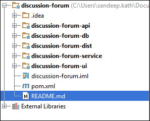
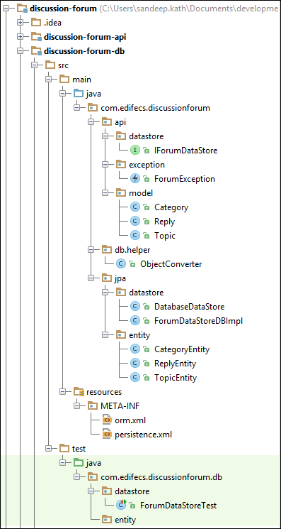
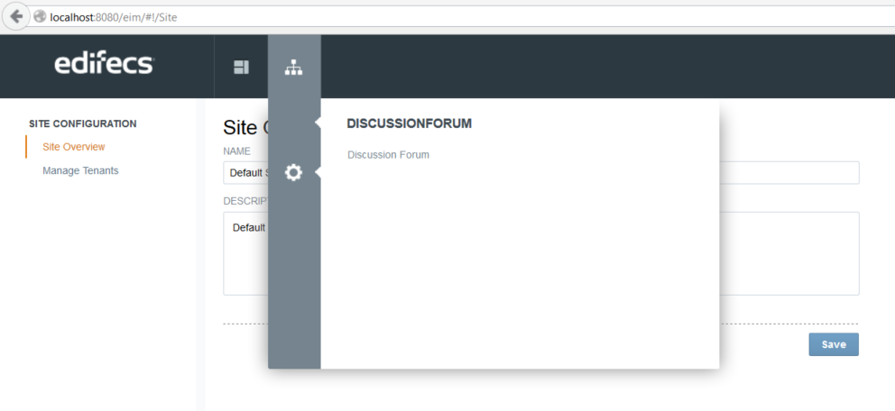
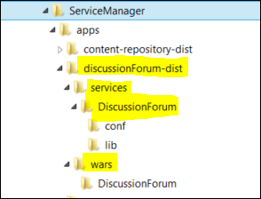
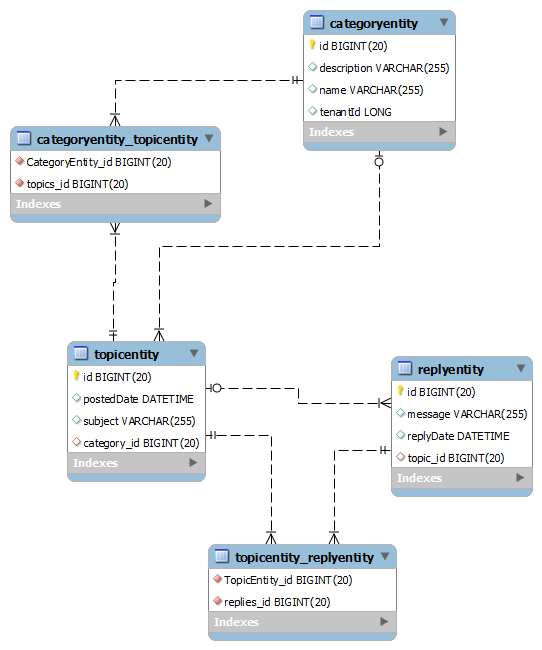

# Discussion Forum

## Overview

This discussion forum is a walk through and usage of Service Manager to develop the applications. This document explains the usage of Service Manager and Application framework to develop the common discussion forum.

We are have discussion forum where user can view and add the posts, Moderator can add topics and administrator can add, manage the categories, topics and users. 

it is assumed that developer has understanding of:

1. Maven
2. Java

##Application Model
 * Application Specific Services
 * Global Services like Single Sign on
 * Services from other applications
 * External Resources
 * Artifacts
 * Security Permissions & roles
 * HTML 5 Web UI
 
 
## Development Environment
1. JDK 1.7
2. Maven 3.x
3. Optional: MySQL Database, Mongo DB

## Project Structure

POM based structure of the project look like this:

 * discussion-forum
    * discussion-forum-db
    * discussion-forum-api
    * discussion-forum-service
    * discussion-forum-ui
    * discussion-forum-dist
    
    

  
### discussion-forum project
Create discussion-forum maven project with following pom contents:

        <?xml version="1.0" encoding="UTF-8"?>
        <project xmlns="http://maven.apache.org/POM/4.0.0"
                 xmlns:xsi="http://www.w3.org/2001/XMLSchema-instance"
                 xsi:schemaLocation="http://maven.apache.org/POM/4.0.0 http://maven.apache.org/xsd/maven-4.0.0.xsd">
            <modelVersion>4.0.0</modelVersion>
            <properties>
                <service.manager.version>1.6.0.0-SNAPSHOT</service.manager.version>
            </properties>
            <groupId>com.edifecs</groupId>
            <artifactId>discussion-forum</artifactId>
            <packaging>pom</packaging>
            <version>1.0-SNAPSHOT</version>
            <modules>
                <module>discussion-forum-api</module>
                <module>discussion-forum-service</module>
                <module>discussion-forum-db</module>
                <module>discussion-forum-ui</module>
                <module>discussion-forum-dist</module>
            </modules>
        </project>

### discussion-forum-db project
Create discussion-forum-db maven project as module under discussion-forum project, it has dependencies for Hibernate as JPA provider and drivers for MySQL, H2 and HSQLDB.

#### JPA Datastore

    <?xml version="1.0" encoding="UTF-8"?>
    <project xmlns="http://maven.apache.org/POM/4.0.0"
             xmlns:xsi="http://www.w3.org/2001/XMLSchema-instance"
             xsi:schemaLocation="http://maven.apache.org/POM/4.0.0 http://maven.apache.org/xsd/maven-4.0.0.xsd">
        <parent>
            <artifactId>discussion-forum</artifactId>
            <groupId>com.edifecs</groupId>
            <version>1.0-SNAPSHOT</version>
        </parent>
        <modelVersion>4.0.0</modelVersion>
    
        <artifactId>discussion-forum-db</artifactId>
    <dependencies>
    
        <dependency>
            <groupId>org.hibernate</groupId>
            <artifactId>hibernate-core</artifactId>
            <version>4.3.5.FINAL</version>
        </dependency>
    
        <dependency>
            <groupId>org.hibernate</groupId>
            <artifactId>hibernate-entitymanager</artifactId>
            <version>4.3.5.FINAL</version>
        </dependency>
    
        <dependency>
            <groupId>org.hibernate</groupId>
            <artifactId>hibernate-c3p0</artifactId>
            <version>4.3.5.FINAL</version>
        </dependency>
    
        <dependency>
            <groupId>org.hsqldb</groupId>
            <artifactId>hsqldb</artifactId>
            <version>2.2.4</version>
            <scope>test</scope>
        </dependency>
    
        <dependency>
            <groupId>com.h2database</groupId>
            <artifactId>h2</artifactId>
            <version>1.3.160</version>
            <scope>test</scope>
        </dependency>
        <dependency>
            <groupId>mysql</groupId>
            <artifactId>mysql-connector-java</artifactId>
            <version>5.1.6</version>
        </dependency>
    
    </dependencies>
        <build>
            <plugins>
                <plugin>
                    <artifactId>maven-dependency-plugin</artifactId>
                    <executions>
                        <execution>
                            <id>copy-dependencies-deploy</id>
                            <phase>package</phase>
                            <configuration>
                                <excludeScope>provided</excludeScope>
                                <useRepositoryLayout>false</useRepositoryLayout>
                                <excludeTransitive>false</excludeTransitive>
                            </configuration>
                            <goals>
                                <goal>copy-dependencies</goal>
                            </goals>
                        </execution>
                    </executions>
                </plugin>
            </plugins>
        </build>
    </project>

Under the discussion-forum-db project, we have created following packages
 
      com.edifecs.discussionforum.api
      com.edifecs.discussionforum.jpa
      com.edifecs.discussionforum.entity
      com.edifecs.discussionforum.datastore
      com.edifecs.discussionforum.db.helper
      
META-INF directory under resources contain the persistence.xml and where we have defined persistence settings:

    <?xml version="1.0" encoding="UTF-8"?>
    <persistence version="2.0"
        xmlns="http://java.sun.com/xml/ns/persistence" xmlns:xsi="http://www.w3.org/2001/XMLSchema-instance"
        xsi:schemaLocation="http://java.sun.com/xml/ns/persistence http://java.sun.com/xml/ns/persistence/persistence_2_0.xsd">
    
        <persistence-unit name="forum-db" transaction-type="RESOURCE_LOCAL">
            <provider>org.hibernate.jpa.HibernatePersistenceProvider</provider>
            <class>com.edifecs.discussionforum.jpa.entity.CategoryEntity</class>
            <class>com.edifecs.discussionforum.jpa.entity.TopicEntity</class>
            <class>com.edifecs.discussionforum.jpa.entity.ReplyEntity</class>
        </persistence-unit>
    </persistence>

 
 
 `DatabaseDataStore.java` and `ForumDataStoreDBImpl.java` classes use the JPA and Entity Manager to do CRUD operations in the database.

#### MongoDB Data Store

We have tested the forum application using Mongo DB. This package include the reference implementation using Mongo DB.

    package com.edifecs.discussionforum.mongo;

Following dependencies are added. Morphia is JPA like provider for Mongo DB.

    <dependency>
        <groupId>org.mongodb.morphia</groupId>
        <artifactId>morphia</artifactId>
        <version>0.107</version>
    </dependency>
    <dependency>
        <groupId>org.mongodb</groupId>
        <artifactId>mongo-java-driver</artifactId>
        <version>2.12.0</version>
    </dependency>
    
Be default discussion forum is configured to use database store, We can switch to MongoDB by changing the API and Model objects. Be careful with IDs. In Mongo DB Ids are always ObjectId and in DB we are using long Ids. 

 _if we face any class loading issues with SM, we can put the Mongo and Morphia libraries in ServiceManager\platform\core\lib\common._
 
## discussion-forum-api project

This module or sub project is an interface between Service Layer and Data Store. Here, we can write the business rules, validation as per the business application context.

`pom.xml` of this project

    <?xml version="1.0" encoding="UTF-8"?>
    <project xmlns="http://maven.apache.org/POM/4.0.0"
             xmlns:xsi="http://www.w3.org/2001/XMLSchema-instance"
             xsi:schemaLocation="http://maven.apache.org/POM/4.0.0 http://maven.apache.org/xsd/maven-4.0.0.xsd">
        <parent>
            <artifactId>discussion-forum</artifactId>
            <groupId>com.edifecs</groupId>
            <version>1.0-SNAPSHOT</version>
        </parent>
        <modelVersion>4.0.0</modelVersion>
        <artifactId>discussion-forum-api</artifactId>
        <dependencies>
            <dependency>
                <groupId>com.edifecs</groupId>
                <artifactId>discussion-forum-db</artifactId>
                <version>${project.version}</version>
            </dependency>
        </dependencies>
    </project>

In our example, it has very basic API requirement for Discussion forum and it has only one package

    com.edifecs.discussionforum.api
    
## discussion-forum-service project

Under lying `pom.xml` of the service project is:

    <?xml version="1.0" encoding="UTF-8"?>
    <project xmlns="http://maven.apache.org/POM/4.0.0"
             xmlns:xsi="http://www.w3.org/2001/XMLSchema-instance"
             xsi:schemaLocation="http://maven.apache.org/POM/4.0.0 http://maven.apache.org/xsd/maven-4.0.0.xsd">
        <parent>
            <artifactId>discussion-forum</artifactId>
            <groupId>com.edifecs</groupId>
            <version>1.0-SNAPSHOT</version>
        </parent>
        <modelVersion>4.0.0</modelVersion>
        <artifactId>discussion-forum-service</artifactId>
    <dependencies>
        <dependency>
            <groupId>com.edifecs.epp</groupId>
            <artifactId>isc-api</artifactId>
            <version>${service.manager.version}</version>
            <scope>provided</scope>
        </dependency>
        <dependency>
            <groupId>com.edifecs.epp</groupId>
            <artifactId>service-api</artifactId>
            <version>${service.manager.version}</version>
        </dependency>
        <dependency>
            <groupId>com.edifecs</groupId>
            <artifactId>discussion-forum-db</artifactId>
            <version>${project.version}</version>
        </dependency>
        <dependency>
            <groupId>com.edifecs</groupId>
            <artifactId>discussion-forum-api</artifactId>
            <version>${project.version}</version>
        </dependency>
    </dependencies>
    </project>

   We have created two packages:
   
    com.edifecs.discussionforum.handler
    com.edifecs.discussionforum.service
    
  Under handler package define the `IDiscussionForumCommandHandler` 

    @Akka(enabled = true)
    @CommandHandler(namespace = "discussion-forum", description = "")
    public interface IDiscussionForumCommandHandler {
        @SyncCommand
        public String greeting();
    
        @SyncCommand
        public Category createCategory(@Arg(name = "category", required = true)
                                           Category category) throws ForumException;
    
        @SyncCommand
        public Topic createTopic(@Arg(name = "category" ,required = true)
                                     Category category, @Arg(name = "topic" ,required = true)
                                                            Topic topic ) throws  ForumException;
    
        @SyncCommand
        @RequiresPermissions("discussionforum:reply:add")
        public Reply addReply(@Arg(name = "topicId" ,required = true) long topicId,@Arg(name = "message", required = true) String message) throws ForumException;
    
        @SyncCommand
        public Category[] getCategories(@Arg(name = "start") int start,@Arg(name = "end") int end) throws ForumException;
    
    
        @SyncCommand
        public Topic[] getTopics(@Arg(name = "categoryId",required = true ) String categoryId, @Arg(name = "start") int start, @Arg(name = "end") int end) throws ForumException;
    
        @SyncCommand
        public Reply[] getReplies(@Arg(name = "topicId", required = true) String topicId, @Arg(name = "start", required = true) int start, @Arg(name = "end") int end) throws ForumException;
    
    }

  Following annotations has required and used to create the command handlers  
  
  **@SyncCommand**: Required to declare this method as command.
  
  **@RequiredPermission**: In this annotation, we define the permissions required to access this command method.
  
  **@Arg**: This annotation is applied on the parameters of the command.
  
  **@Akka**: Enables Akka messaging on this class. (Not strictly required; is enabled by default anyway)
  
  **@CommandHandler**: Applied at command handler interface level.
   
 `DiscussionForumCommandHandler.java` has implementation of the interface `IDiscussionForumCommandHandler.java`
  
  Sample implementation of command `getReplies`
 
      @Override
         public Reply[] getReplies(@Arg(name = "topicId", required = true) String topicId, @Arg(name = "start") int start, @Arg(name = "end") int end) throws ForumException {
             Topic topic = new Topic();
             topic.setId(Long.parseLong(topicId));
             return forumAPI.getReplies(topic, start, end);
         }

### Discussion Forum Service

Create Java interface with following code sample to initialize it as service and register the command handler

    @Service(
            name = "discussion-forum-service",
            version = "1.0",
            description = "Discussion Forum Service",
            properties = {@Property(name = "name", propertyType = Property.PropertyType.STRING, description = "Discussion Forum Name" , defaultValue = "Technology Trends", required = false)}
    )
    public interface IDiscussionForumService {
    
        @Handler
        IDiscussionForumCommandHandler getDiscussionForumCommandHandler();
    }
    
Implement the Interface class to create an implementation of the service

    public class DiscussionForumService extends AbstractService implements IDiscussionForumService {
        private Logger logger = LoggerFactory.getLogger(DiscussionForumService.class);
    
        @Override
        public void start() throws Exception {
            String greet = getProperties().getProperty("name");
        }
    
        @Override
        public void stop() throws Exception {
    
        }
    
        @Override
        public IDiscussionForumCommandHandler getDiscussionForumCommandHandler() {
            return new DiscussionForumCommandHandler();
        }
    }

### Security

Place the `security.json` under src/dist/conf folder with following contents. For demo purpose, we have added only one permission where assigned user can add replies to the topics.

This structure also defines the `Discussion Forum Contributor` role as well. These permissions and roles will be loaded into the ESM and admin can assign these roles and permissions to the users to login into discussion forum and do the operations as per the permissions. 
  
      {
          "permissions": [
              {
                  "permission": "discussionforum:reply:add",
                  "name": "addReplyPermission"
              }
          ],
          "roles": [
              {
                  "name": "Discussion Forum Contributor",
                  "description" : "Discussion Forum Contributor",
                  "permissions": ["addReplyPermission"]
              }
          ]
      }

## discussion-forum-ui Project

This is standard web project which contains HTML, Java script, web.xml.

    <?xml version="1.0" encoding="UTF-8"?>
    <project xmlns="http://maven.apache.org/POM/4.0.0"
             xmlns:xsi="http://www.w3.org/2001/XMLSchema-instance"
             xsi:schemaLocation="http://maven.apache.org/POM/4.0.0 http://maven.apache.org/xsd/maven-4.0.0.xsd">
        <parent>
            <artifactId>discussion-forum</artifactId>
            <groupId>com.edifecs</groupId>
            <version>1.0-SNAPSHOT</version>
        </parent>
        <modelVersion>4.0.0</modelVersion>
        <artifactId>discussion-forum-ui</artifactId>
        <packaging>war</packaging>
    </project>
    
This project is independent of any service API, DB. Services are deployed in the service manager RESTful/RPC via JSON. In this example, we used jQuery, Bootstrap to create the sample UI.

### Navigation
 
Copy `nav.json` file into src/dist/conf with the following contents, Discussion forum application link will be visible under doormat menu.

 
     {
         "service": "DiscussionForum",
         "id":      "DiscussionForum",
         "name":    "DiscussionForum",
         "iconUrl": "/discussion-forum-ui/resources/images/discussionforum.png",
         "columnOne": [{
             namespace: "app",
             id:             "7-manageapp",
             text:           "Discussion Forum",
             linkUrl:        "/discussion-forum-ui",
             permission: "platform:security:administrative:user:view"
         }]
     }

## discussion-forum-dist project

Create the maven project with the following dependencies:

     <dependencies>
            <dependency>
                <groupId>com.edifecs</groupId>
                <artifactId>discussion-forum-db</artifactId>
                <version>${project.version}</version>
            </dependency>
            <dependency>
                <groupId>com.edifecs</groupId>
                <artifactId>discussion-forum-api</artifactId>
                <version>${project.version}</version>
            </dependency>
            <dependency>
                <groupId>com.edifecs</groupId>
                <artifactId>discussion-forum-service</artifactId>
                <version>${project.version}</version>
            </dependency>
            <dependency>
                <groupId>com.edifecs</groupId>
                <artifactId>discussion-forum-ui</artifactId>
                <version>${project.version}</version>
                <type>war</type>
            </dependency>
        </dependencies>

Use Maven assembly plugin to create the distribution package

            <plugin>
                <artifactId>maven-assembly-plugin</artifactId>
                <executions>
                    <execution>
                        <id>create-dist</id>
                        <phase>process-resources</phase>
                        <goals>
                            <goal>single</goal>
                        </goals>

                        <configuration>
                            <finalName>${app.dist.name}</finalName>
                            <appendAssemblyId>true</appendAssemblyId>
                            <descriptors>
                                <descriptor>src/main/assembly/dist.xml</descriptor>
                            </descriptors>
                        </configuration>
                    </execution>
                </executions>
            </plugin>
            
 dist.xml assembly will copy following artifacts:
 
  1. Required JAR Files
  
  2. MANIFEST.yaml file
  
  3. Conf files
  
  4. UI Resources
  
Here is the sample dist.xml file

    <assembly
            xmlns="http://maven.apache.org/plugins/maven-assembly-plugin/assembly/1.1.1"
            xmlns:xsi="http://www.w3.org/2001/XMLSchema-instance"
            xsi:schemaLocation="http://maven.apache.org/plugins/maven-assembly-plugin/assembly/1.1.1 http://maven.apache.org/xsd/assembly-1.1.1.xsd">
        <formats>
            <format>zip</format>
            <format>dir</format>
        </formats>
    
        <baseDirectory>/</baseDirectory>
        <dependencySets>
            <dependencySet>
                <useProjectArtifact>false</useProjectArtifact>
                <outputDirectory>services/discussion-forum-service/lib</outputDirectory>
                <outputFileNameMapping>${artifact.artifactId}-1.0.0.0.${artifact.extension}</outputFileNameMapping>
                <includes>
                    <include>*:jar</include>
                </includes>
            </dependencySet>
            <dependencySet>
                <useProjectArtifact>false</useProjectArtifact>
                <outputDirectory>wars/discussion-forum-service/</outputDirectory>
                <outputFileNameMapping>${artifact.artifactId}.${artifact.extension}</outputFileNameMapping>
                <includes>
                    <include>com.edifecs:discussion-forum-ui:*:war</include>
                </includes>
            </dependencySet>
        </dependencySets>
    
        <fileSets>
            <fileSet>
                <directory>${project.basedir}/src/dist/</directory>
                <outputDirectory>/</outputDirectory>
            </fileSet>
        </fileSets>
    </assembly>

### App Directory Structure

App should have following structure

1. Services directory will contain all the jar files including dependencies for the API, Service and DB into this `AppDirectory/services/AppName/lib` under apps directory.

2. Configuration file like 'security.json' and 'nav.json' will be copied to `AppDirectory/services/AppName/conf` under apps directory.

3. WAR file be copied to `AppDirectory/wars/AppName/` under apps directory.

## App Manifest file

This manifest file will tell the SM container to configure it with its components, services and properties. It will be used to configure on ECM as well.

This file should be placed in the root of the application zip and be called MANIFEST.yaml

    ---
    manifestVersion: 1.0.0
    
    name: DiscussionForum
    version: 1.0.0.0
    displayName: DiscussionForum
    displayVersion: 1.0.0.0
    description: Discussion Forum
    
    physicalComponents:
      - name: discussion-forum-service
        version: 1.0.0.0
        displayName: DiscussionForum
        description: Discussion Forum Service
        type: docker
        scheduling:
          imageUri: SERVICE
          classname: com.edifecs.discussionforum.service.DiscussionForumService
          scheduler: service
    
        properties:
          - name: DiscussionForum
            description: Specifies the name of the system user in the discussion forum.
            scope: Service
            constraint:
              dataType: string
              defaultValue: HelloWorld
    ...

## App Deployment

1. Go to the service manager and copy the app under ServiceManager/apps 
2. Start the service manager 

### RESTful/HTTP RPC Service test

We can use Chrome plugin like Postman to investigate the JSON structure and response coming from the services

For example: This call is getting JSON response from the Service Manager to get the categories of discussion forum:

`http://localhost:8080/rest/service/DiscussionForum/getCategories`  
 
Sample JQuery Script interacting with discussion-forum-service using HTTP GET

        
        
  
### Pass JSON from UI to map with POJO as parameter in Command Handler
  
POJO conversion is done when we use HTTP POST and "data" parameter with JSON values is required as explained below:

For example, we have command handler which has POJO as parameters and UI need to pass the JSON and it will be converted into the POJO automatically by JSON Servlet

            URL : http://localhost:8080/rest/service/discussion-forum-service/discussion-forum.createTopic
            Method: POST 
            - discussion-forum-service is Service name defined in Service annotation
            - discussion-forum.createTopic is a command handler with namespace defined in command handler
              
              data: { "topic":{"categoryId":"iOS","topicSubject":"iPhone"}}

## FAQ

### How to add new database connection to the service manager?

Please use the following steps:

1.	Define DB Resource in Application Meta  or core-configuration.xml

            <Resource>
                <Description></Description>
                <Name>`Persisted MySQL`</Name>
                <Property>
                    <Name>URL</Name>
                    <Value>jdbc:mysql://localhost:3306/security</Value>
                </Property>
                <Property>
                    <Name>Driver</Name>
                    <Value>com.mysql.jdbc.Driver</Value>
                </Property>
                <Property>
                    <Name>Dialect</Name>
                    <Value>org.hibernate.dialect.MySQLDialect</Value>
                </Property>
                <Property>
                    <Name>Username</Name>
                    <Value>security</Value>
                </Property>
                <Property>
                    <Name>Password</Name>
                    <Value>welcome</Value>
                </Property>
                <Property>
                    <Name>AutoCreate</Name>
                    <Value>true</Value>
                </Property>
                <Type>JDBC Database</Type>
            </Resource>

2.	Associate the DB resource with the service meta information in application meta or core-configuration.xml

           <!-- Security Service -->
            <Service>
                <Name>Security Service</Name>
                <ServiceType>Security Service</ServiceType>
                <Description>Security Service</Description>
                <LogLevel>WARNING</LogLevel>
                <Version>1.0</Version>
                <Resource>
                    <Name>Persisted MySQL</Name>
                    <TypeName>Security Database1</TypeName>
                </Resource>
            </Service>                                                    

3.	While starting the service, load “Security Database1” in your service

        public class SecurityService extends AbstractService {
            SecurityServiceCore core = new SecurityServiceCore();
            @Override
            public void start() throws Exception {
               core.doStart(getProperties(), getResources()
                              .get("Security Database1"), getCommandCommunicator(), getAddress(), new FileInputStream(SystemVariables.SECURITY_CERTIFICATE_FILE));
                        }
          }

### How to get security manager context and get current logged in users roles and permissions in Services?

In any service, we can use security manager to get authentication, authorization and session information.

Command communicator provides Security Manager context to get security information:

  * Authentication Manager
  * Authorization Manager
  * Subject Manager
  * Session Manager
 
                 if(getCommandCommunicator().getSecurityManager().getAuthenticationManager().isAuthenticated()) {
                    if(getCommandCommunicator().getSecurityManager().getAuthorizationManager().hasRole("discussionforum:reply:add")) {
                        logger.info("Current logged in user " +getCommandCommunicator().getSecurityManager().getSubjectManager().getUser().getUsername());
                        logger.info("User Session ID " +getCommandCommunicator().getSecurityManager().getSessionManager().getCurrentSession());
                    }

                }
                   
### How to get Tenant ID and use it to get its content?

We can get the current logged in user's Tenant ID by using Command Communicator in the services or command handler implementation

       long tenantId = getCommandCommunicator().getSecurityManager().getSubjectManager().getTenant().getId();
       
Tenant ID can be passed to data store to get the contents as per the tenant. For example, in our forum example, we have put the tenantId field in the Category master table and content is filtered as per this tenant ID.

## TBD

1. Application packaging is half manual. 
2. Permissions loaded from security.json are broken.

