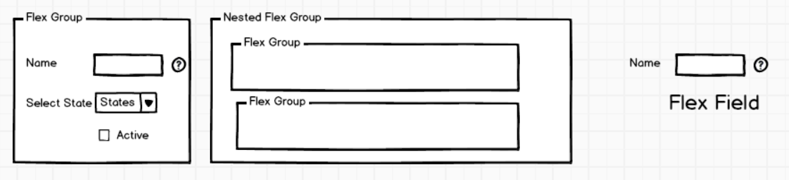
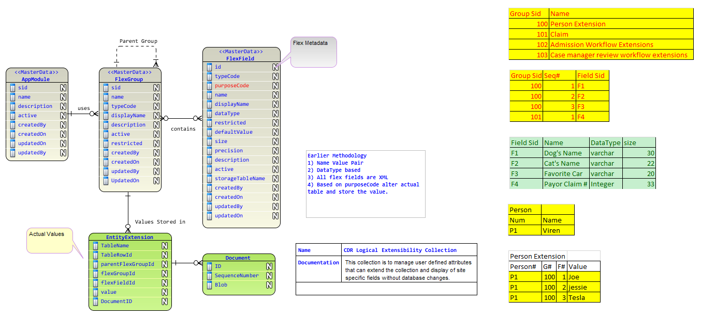
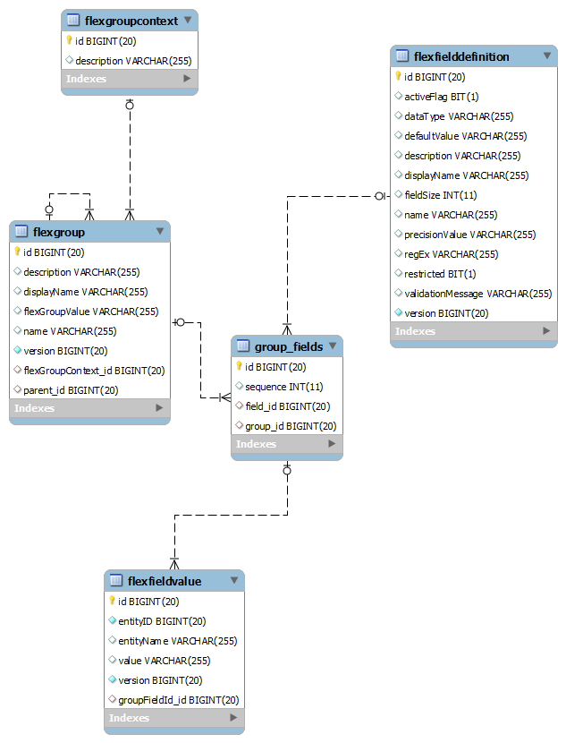
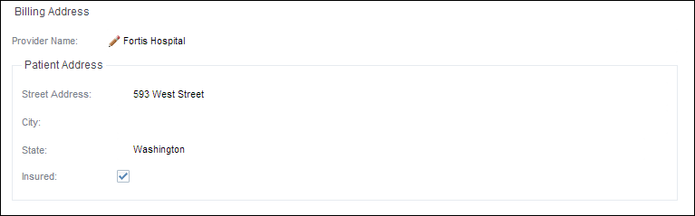

# Flex Field Design

## Why We need Flex Field

* Flex fields can be context sensitive as per the application, form, tenant configured at design of application OR configuring the tenant.
* Customize the data fields to meet the business needs without programming
* Flex fields provide customizable expansion space on the forms. We can use flex fields to add additional information to the forms. 

## Key Concepts

* Flex Field
* Flex Group
* Flex Field Value

 

### Flex Field

Flex Field is definition of the field which will define the field with following properties:

  * Name
  * Namespace
  * Type
  * Display Name
  * Data Type
  * Restrictedo
  * Default Value
  * Size
  * Precision
  * Description
  * Active
  * Regular Expression
  * Validation Message
  * Flex Field Type
  * Help Hint(TBD)
  * Custom CSS (TBD)
  * Custom URL (TBD)
   * JS Code (TBD)

### Flex Group

Flex group contain many flex fields OR nested flex groups with sequence order as they will be displayed in the UI.

  * Name
  * Namespace
  * Description
  * Display Name
  * Tenant 
  * Application 
  * Component 
  * Entity 
  * Parent Flex Group
  * Custom CSS/JS/URL (TBD)

### Flex Field Value

Flex field value initially will be persisted in the generic data store and further it can be extended to many data stores depending upon the entities, tenants or application specific data stores

  *           Flex Group
  *           Flex Field
  *           Entity Name
  *           Entity ID
  *           Value

## Logical Model

## DB Model

_Diagram may not include all fields. it is depicting the relationship at table level._

## Flex Field API

API is divided into two groups:

1.            FlexFieldRegistry: Use to manage the flex field definitions, groups
    *         FlexField Definition CRUD
    *         FlexGroup Definition CRUD
    *         FlexField Definition and Flex Group Mapping CRUD
    *         Utility methods to get list of groups, flex fields for application, tenant, entity.
2.            FlexFieldManager
    *         Flex Field Values CRUD
    *         Utility methods to read values of fields for a flex group.

## Flex Field UI Component

* The component in ExtJs is added using -

               {
                   xtype:'flexfieldcomponent',
                   layout:'anchor',
                   defaults:{'anchor':'50%'},
                   margin:'10 0 10 0',
                   fieldConfigurationUrl:'resources/json/TestFieldConfiguration.json', // URL for configuration file
               }

  
* Flex Field component configuration JSON

              {
                "flexGroupUrl":"/rest/service/flexfields-service/FlexField.getFields", //flexfield service command to get fields
                "saveValueUrl":"/rest/service/flexfields-service/FlexField.setFlexFieldValue", //flexfield service command to save field values
                "tenantName":"*",
                "enableRootHeader":true, // enable/disable border for root field set.
                "appName":"ESM",
                "componentName":"UserProfile",
                "entityName":"UserEntity"
              }
                                                  
* Configuration JSON is received from backend through command **textfield.getFields** by passing following params

              {
	              "contextMap":
	              {
                    "tenantName":"*",
                    "appName":"ESM",
                    "componentName":"UserProfile",
                    "entityName":"UserEntity",
                    "entityId": "2" 
	              }
              }
                

* Flex Field value is saved using command **textfield.setFlexFieldValue** with params: 

               {
                  "flexFieldValue": 
                   {
					  "flexFieldDefinitionId": 1,
					  "flexGroupId": 1,
					  "entityName": "UserEntity",
					  "entityID": 2,
					  "value": "10"
		            }
                }

Here entityID is the Id for the entity rendered in the page where flexField component is added. 

**Example** : 

1.For User profile page entityID is the current user's id.

2.For Tenant detail page entityID is tenant's Id.

**NOTE:** FlexField component expects it's parent page to set the entityID for this component before it is being rendered.

**entityID** can be set using following code snippet :

**me.down('flexfieldcomponent').setEntityId(record.get('id'));**

Here **me** is a reference for parent page where flexfield component is added and record is entity record.

**SAMPLE OUTPUT**

## Parsing App Manifest File for Profile Attributes

Currently, FlexField API provides method to parse and create the flexfield groups and fields

    public void parseAppManifest(InputStream manifestStream) throws Exception 
    
We need to pass app manifest input stream and it will create fields.

Sample manifest profile attributes defined in the manifest.yaml
    
     profileProperties:
          - name: account.lockout.counter.reset.interval
            description: Specifies the interval in minutes that needs to pass since the last logon attempt (successful or unsuccessful) to automatically reset the number of unsuccessful logon attempts to 0.
            defaultValue: 5
            scope: user
            constraint:
              dataType: string
              regex: thisisaregex
              something: else
              validationMessage: Hello!
              
  
  Data Types can be:
  
  * group
  * string
  * boolean
  * long
  * string with enumerations for selection
  

## Permissions and Security

Permissions and security is defined at Flex group and flex field level. There are two fields in both entities
  
  * restricted
  * permissionRequired
  
  if the restricted field is marked as true boolean value that mean the system will check for its permissions. Permissions are matched with logged in the users permissions. if user permissions are matching with flex field or flex group permissions then flex field or flex group will part of the "getFields()" collection output.
  
  Security/Permission check has been applied at service level as we have login information during the service calls. 
  
  Permissions are combined if they are applied on field as well group. Combined permissions are checked with logged in user.
  
  For example: 
  
  Group field can have permission list like 

        'platform:security:administrative:tenant:edit,platform:security:administrative:tenant:delete' 

## Secured Flexfields Access using ESM

To prevent the un-authorized access to the flex values and fields of any entity, we need to put the check and balances to prevent the mis use of the flex fields and values.

We will expose the access of flex fields by Edifecs Security Manager. There are following scopes to access the flexfields by ESM:

1. User 
2. Tenant 
3. Organization 
4. System 

**ESM** will have additional command handler like **IFlexFieldHandler** and it will expose the two commands:

**getFields(ContextMap)**  - Context Map will contain:
              
              {
                "contextMap":
                {
                    "tenantName":"*",
                    "appName":"ESM",
                    "componentName":"*",
                    "entityName":"UserEntity" | "TenantEntity" | "OrganizationEntity" | "System"
                    "entityID" : long Id of the entity
                }    
              }
            
At ESM, getFields() will validate the current user authorization with supplied values in the contextMap

it will do the following security checks:

 1. it will check if user is authorized to access particular scope and particular instance id. For example, logged in user does not have access to the Tenant Configuration. 
    Security check logic will verify:
           
           if user belong to the same tenant|user|org|system ID as per context entity ID.
           if user has permission to configure the tenant|org|user|system or not
    
 2. This logic will be applied to all scopes. 
  

**setFlexFieldValue** 

Similar checks will be applied before storing/updating the flex field value.
   
                {
                  "flexFieldValue": 
                   {
					  "flexFieldDefinitionId": 1,
					  "flexGroupId": 1,
					  "entityName": "UserEntity",
					  "entityID": 2,
					  "value": "10"
		            }
                }

              
