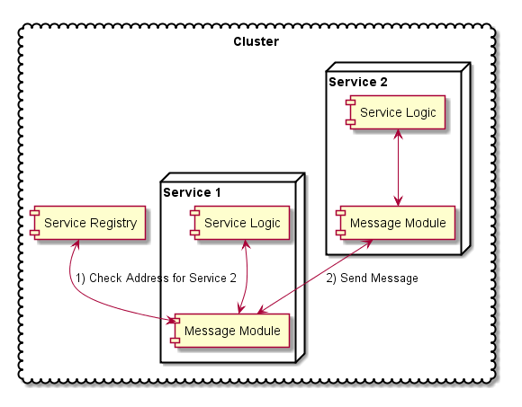

# Inter-Service Communication Module

## What is the Inter-Service Communication Module?

The Message Module is the core of the intercommunication between services. This is a wrapper around the under lying
technologies to handle incoming and outgoing messages. 

  
## Why do we need the Inter-Service Communication Module?

The ability for one remote system to connect with another remote system have been around for a long time. Things like
JMS, REST, WebServices are all standardized ways to communicate when you know who you need to talk with.
  
In order to determine who to communicate with, and who is available in a cluster, other technologies have been created
to solve these problems like JGroups which allows for the auto discovery and formation of clusters of machines on top of
the inter communication. There are many implementations following a similar model specialized to handle specific
distributes message scenarios like Storm.

When it comes to Inter-Service Communication, there are many concerns that need to be addressed:
  
  * Security - Pass security context along with message and auto check user session.
  * Service Discovery - Coordination Service - Integration in with our Service Registry which stores whats running
    where, status information, and critical configurations.
  * Message Routing - Ability to configure how the communications are routed, for example, tenant specific services,
    round robin, or pull based models for message passing.
  * Load Balancing - Ability to define and handle key load balancing scenarios for services with multiple instances.
  * Multi Tenancy - Ability to route messages based on tenant and application configurations.
  * Monitoring - Monitor all traffic and capture usage statistics for use in billing and auto scale and SLA scenarios.
  * Auditing - Track who is doing what so we can mine the data or look for security violations.
  * Exception Handling - Track thrown exceptions and be able to feed this into our auto scale and infrastructure system
    to act on errors.

## How does the Inter-Service Communication Module solve the problem?

To solve it we create a standard set of interfaces for an application to implement, and translate that based on the
configuration into the correct proven distributed messaging technologies.
  
There are many such as:
  
  * Akka - Handles all communication within the cluster; also supports async, nonblocking and callback-based message
    processing
  * Zookeeper - Functionality of the Coordination Service
  * Spray.IO - REST-based communication requests replacing the Java servlet
  * Serf - Potential cluster discovery alternative

## Message Implementations

### [ISC Message API](docs/isc.md)

Handles all Sync and ASync message processing for the cluster. It supplies both a way to send commands, and to register
commands to be executed. It also integrates into the Service Registry to identify the cluster topography.
  
### [MPP (Storm / PubSub)](../mpp/README.md)

PubSub is an unrelated module to the main Message API, however is directly related to the processing flow in a
distributed system.

### [Async Servlet](docs/async_servlet.md)

Async servlet model using Spray.IO over the default java servlet model. It promotes async and future type callback for
the rest based communication.

# Additional Reference Links

  * [Akka](http://doc.akka.io/docs/akka/snapshot/java/cluster-usage.html)
  
  * [Non Blocking Development Pattern](http://en.wikipedia.org/wiki/Non-blocking_algorithm)
  
  * [The Importance of Pulling](http://blog.goconspire.com/post/64901258135/akka-at-conspire-part-5-the-importance-of-pulling)
