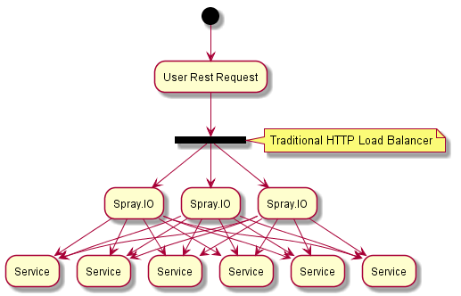

# Async Servlet Module

The default http servlet supplied by java is not a non blocking implementation. There are some key improvements that can
be made to better handle large number of concurrent connections and long running requests.
  
The 1.2 implementation of the JSON servlet uses the java servlet and manages the users HTTP session, and forwards the
communications on through to the Jgroups based communication model. This is a thread blocking solution wherer the http
servlet request waits while the remote calls are made.
  
In the 1.5 implementation, we are removing this blocking scenario and using the proper implemetation of future. This
means the clients browser will make the call and wait (based on the JS and ajax used) while the servlet will pass the
message along with a future callback to handle the response to the users browser when the requests be completed.
  
The other key difference between the 1.2 and the 1.5 implementation is how uploading of streams is handled. In 1.2 the
web serer is in charge of uploading the full file before passing it onto the java servlet for handling blocking the
call, however in 1.5 using spray.io, the upload stream is completly managed by the application, meaning the stream can
be forked and does not need to be fully uploaded before writing to a permanent store halfing the IO operations.
  
An application developer never needs to directly interact with the servlet model, as its all managed as part of the
platform and ISC (Inter Service Communication) module.

## Spray.IO

"spray is an open-source toolkit for building REST/HTTP-based integration layers on top of Scala and Akka. Being
asynchronous, actor-based, fast, lightweight, modular and testable it's a great way to connect your Scala applications
to the world."

[Spray.io](http://spray.io/)

Spray.IO works as either its own server, or can be embedded into existing servlet containers such as Jetty, tomcat,
etc...

At a high level, the overall design will work like this:
  

Spray IO sits behind traditional load balancer (software or hardware) and ties the user with the same Spray.IO instance.
If an instance goes offline, the user will not need to reauthenticate, as the new Spray.IO instance will grab the users
session/cookie, check with the Security Service and continue. This means that the load balancer can redistribute the
users to balance out load if there is performance problems with specific instances.

When Spray.IO receives the command it forwards the command through our internal service communication module, which is
built on Akka using an actor/service model. This will handle all the load balancing from a internal service perspective.

## Usage

### Deployment

Deployment within the Platform is auto deployed if you have the Web Application Service installed on the cluster.
  
If the web resources are managed in a separate Web Server like Tomcat, or Jetty, Websphere, etc... it requires the
deployment of this as a WAR file or as an independent servlet too /json/.
  
It then needs to be configured for it to identify with the cluster.
