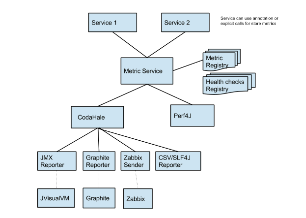
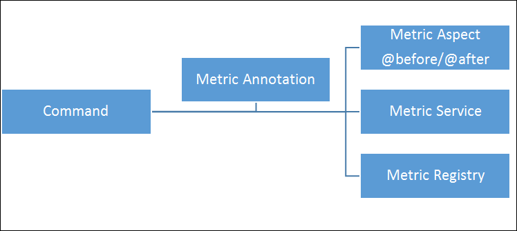
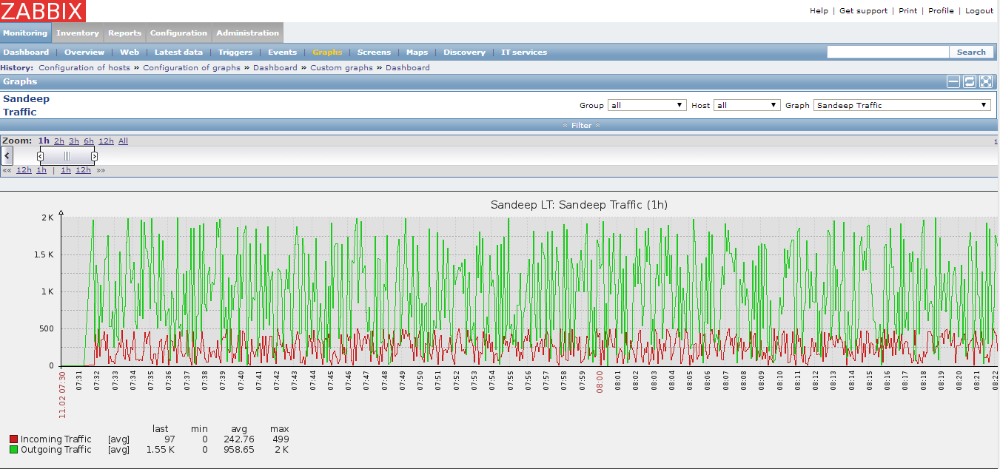
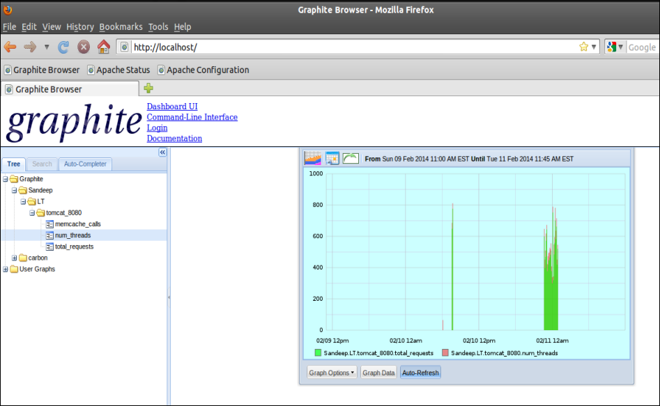

# Metrics Collection

## Overview

Currently metrics can be enabled and collected at service level. Service contains various commands and commands can be annotated to provide the metrics.

## Metric API

We have recommended to use Coda Hale Metric API to provide the metric collection in Service Manager.

## Metric Collection

Metric will be collected at command level under service. Following metrics will be used:

* Gauge
* Meter
* Counters
* Timer
* Histogram

## Metric Collection Annotations

Following annotated will be required to enable annotation at commands in service

**@Metered (name=”meter1”)**

**@Timed(name=”timer1”)**

**@ExceptionMetered**

**@Gauge (name =”gauge1”)**

**@Histogram**

**@Counted**

## High Level Architecture

## Metric Registry

Metric Registry is registry or collection of metrics for particular application, tenant OR server level. Multiple registry will be created as per application or tenant. There would be system level metric registry.

Metric registries can be initialized at starting of the Service manager and metrics will be collected to designated metric registry by identifying tenant or application or system level registry which should be configurable.

## Health check Registry

Health checks are self-tests which can be invoked by application OR services to verify its operation OR performing correctly. Design for health checks is similar to metric registry.

# Metric Service

Metric service is wrapper around coda-hale metric API and it does following

1. Registers Reporters and senders to particular Metric Registry
    - Zabbix Sender. 
    - Graphite Reporter
    - CSV Reporter
    - JMX Reporter
    - SLF4J reporter
2. CRUD for Metric Registries
3. Metric Collection from various commands

## Metric collection using Annotation

1. Each command will annotate with Metric annotation
2. As per metric annotation, corresponding aspect will use to define point-cuts.
3. Aspect will also define the join-points which further invoke metric service to update the metric.

## Metric Reporters

There will be configuration to define the metric reporters where metric service will report the metrics. It can be zabbix sender OR any coda hale supported reporters.
A Reporter needs to be configured in the **config.properties** file.

### Console Reporter 
Reports all the metrics to the console. 
#### Properties 
    metric.reporter.type=console
    metric.reporter.period=3 (period : reporting interval)
    metric.reporter.unit=seconds (time unit for period : seconds, minutes, hours)
### CSV Reporter 
Reports all metrics to their respective CSV files. 
Csv file name format : <metricname>.csv
#### Properties 
    metric.reporter.type=csv
    metric.reporter.period=3 (period : reporting interval)
    metric.reporter.unit=seconds (time unit for period : seconds, minutes, hours)
    metric.reporter.data.directory=../reports (an existing valid directory where csv files will be created)
### Zabbix Reporter
Exposes registered metrics to be collected by a running zabbix server.
This is achieved by using an adapter project [metrics-zabbix](https://github.com/janramm87/metrics-zabbix)
#### Properties 
metric.reporter.type = zabbix
metric.reporter.host = zabbix01 (host on which the zabbix server is running)
metric.reporter.port = 10051    (port on which zabbix server is listening)
#### Zabbix Configuration
* create a valid host i.e the host where the above properties have been defined, and will eventually send data to zabbix
* create an item with the following configuration:
    - any suitable name
    - format for item key is (metricname.metric-key) e.g test.test  
      Please see below for more information on metric keys.
    - Zabbix agent (active) 
    
##### Metric Keys
The supported metric-keys depends on the metric type

###### Counter
any metric-key specified will return the current count
###### Gauge
any metric-key specified will return the current count
###### Histogram
supported metric-keys:
MAX,
MIN,
MEDIAN,
MEAN,
STDDEV, 
P75TH,
P95TH,
P98TH,
P99TH,
P999TH,
COUNT

###### Meter

supported metric-keys:
MEAN_RATE,
ONE_MINUTE_RATE,
FIVE_MINUTE_RATE,
FIFTEEN_MINUTE_RATE,
COUNT

###### Timer
supported metric-keys:
MEAN_RATE,
ONE_MINUTE_RATE,
FIVE_MINUTE_RATE,
FIFTEEN_MINUTE_RATE,
COUNT
MAX,
MIN,
MEDIAN,
MEAN,
STDDEV,
P75TH,
P95TH,
P98TH,
P99TH,
P999TH

### JMX Reporter
With JmxReporter, you can expose your metrics as JMX MBeans. 
To explore this you can use VisualVM (which ships with most JDKs as jvisualvm) with the VisualVM-MBeans plugins installed or JConsole (which ships with most JDKs as jconsole): 

#### Properties 
metric.reporter.type = jmx
##### Zabbix JMX Configuration
Zabbix can also be configured to listen for JMX MBeans, and since metrics are also exposed by codahale as MBeans,
zabbix can report metrics via JMX. The zabbix jmx configuration is beyond the scope of this document. However, registering 
metrics MBeans items is the same as listening for JVM MBeans items.

### Sample Zabbix Sender

We can send metric data to zabbix using following way and it is send as JSON which can be monitored real-time in Zabbix

1. Create JSON with host, key, value. Where key,value pair is metric name and its value.

        {
        "request":"sender data",
        "data":[
            {
                "host":"Server_TM_01",
                "key":"traffic_inbound",
                "value":"1045"
            } ]
        }
        
2. Encrypt it with Base 64 and convert to byte stream
3. Send this byte stream to zabbix_server:10051 port
4. Configure the zabbix for host “Server_TM_01” with new item like “traffic_inbound”
5. Under Monitoring option of zabbix, we can see the traffic or custom graphs for this metric.
6. When we send any JSON to zabbix, it sends back the acknowledgement JSON with success, failure message for sent information.

As shown in image captured to display the traffic graph of PC where we are sending the metric data from Java program to zabbix and it is displayed using custom chart.

### Graphite Reporter

Coda hale has inbuilt support to send the metric data to Graphite. We can also using custom code to send the any metric data to graphite to plot real time time series graph without using coda-hale metric API.

1. Send the metric data to Graphite_HOST: 2003 port
2. Sample code is sending the metric data using Socket API

> private void logToGraphite(String nodeIdentifier, Map<String, Object> stats) throws Exception { 
    Long curTimeInSec = System.currentTimeMillis() / 1000; 
    StringBuffer lines = new StringBuffer(); 
    
    for (Map.Entry entry : stats.entrySet()) { 
        String key = nodeIdentifier + "." + entry.getKey(); 
        lines.append(key).append(" ").append(entry.getValue()).append(" ").append(curTimeInSec).append("\n"); 
    } 
    
    logToGraphite(lines); 
    } 
    
    private void logToGraphite(StringBuffer lines) throws Exception { 
        String msg = lines.toString(); 
        logger.info("Writing [{}] to graphite", msg); 
        Socket socket = new Socket(graphiteHost, graphitePort); 
        try { 
            Writer writer = new OutputStreamWriter(socket.getOutputStream()); 
            writer.write(msg); 
            writer.flush(); 
            writer.close(); 
        }catch (Exception e) { 
            e.printStackTrace(); 
        } finally { 
            socket.close(); 
        } 
    }

# Metering POC using Annotation & aspectJ

We can annotate the command or service method like using this POC

> 
    @Counted(name = "counter")
    public String getTitleById(int id) { 
        try { 
            return data.get(id); 
        } catch (Exception e) { 
            e.printStackTrace(); 
            return e.getMessage(); 
        } 
    }

POC code has been checked in along with Zabbix & Graphite reporter  
[Zabbix & Graphite reporter](https://ecsvn01.edifecs.local/engineering/prototypes/sharedservices/metering_poc)

# Log Monitoring

Logs can be monitored using zabbix and it can send notifications or warnings to the users.

[More details](https://www.zabbix.com/documentation/2.0/manual/config/items/itemtypes/log_items)