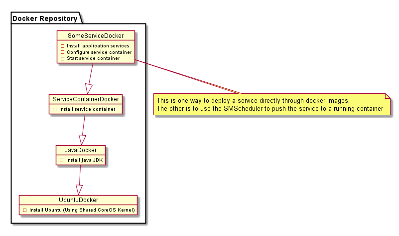
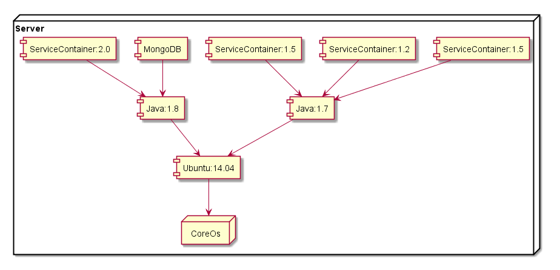

# ServiceManager EAS/Docker Installation/Deployment

## Application Deployment to EAS

The sm-eas-deploy utility makes the deployment to EAS simple for SM Services, and other Application Factory components
like XBoard.

EAS (Edifecs Application Store) consists of two components.

  * Manifest Registry
  * Docker Registry

Taking the ([App Zip Structure](Packaging.md)) as an input it:

  * Deploys the applications Manifest file from the app zip file and uploads it too the Manifest Registry.
  * Turns the app zip into a docker container and uploads it to the specified docker registry.

This tool can be run as a standalone utility, as a SBT plugin, or Maven plugin.

Details on it's use can be found here:

[sm-eas-deploy Utility Usage](../tools/sm-eas-deploy/README.md)

## How the docker generation work

At the lowest level, the SM container is deployed to a machine though ECM using Docker. This is just like
all other containers deployed through ECM (MongoDB, Hadoop, Storm, Kaftka, MySQL, etc...).

The UML below show the different Docker images and what they are responsible for to install the SM container.

 

### Example SM Docker install process

The actual docker install process Takes care of the entire install process:

  * Depends on the registry:5000/js docker which installs Ubuntu, Java and Scala
  * Downloads and unzips SM Container
  * Downloads the Applications containing the services to run
  * Pull configurations from ECM and Manifests to configure SM.
  * Runs SM Node
  * Docker opens up port 8080 to the docker container
  

Base Docker file:

    FROM registry:5000/js
    MAINTAINER William Clements <william.clements@edifecs.com>
    
    RUN wget https://10.30.18.25/service/local/repositories/snapshots/content/com/edifecs/epp/sm-dist/0.1.0.0-SNAPSHOT/sm-dist-0.1.0.0-SNAPSHOT.tar.gz '--no-check-certificate'
    RUN mkdir /opt/edifecs/
    RUN chmod 755 /opt/edifecs/ -R
    RUN tar xzf sm-dist-0.1.0.0-SNAPSHOT.tar.gz -C /opt/edifecs/
    RUN chmod 755 /opt/edifecs/ -R
    
    CMD /opt/edifecs/sm-dist-0.1.0.0-SNAPSHOT/ServiceManager/bin/startNode.sh -nodeName=Core -cluster.name="TestDockerSMCluster"
    
    EXPOSE 8080
    EXPOSE 7800

### Details of an Application Docker File

Applications are deployed as docker images as well. These docker images have the base SM docker image as a FROM 
configuration `FROM registry:5000/sm`

These are generated by using a library that bundles and deploys an application and its resources to EAS and the docker
registry (`sm-eas-deploy`). It takes the defined SM\application factory app structure, and will automatically build and
deploy the components of the app to where they are needed.

Maven and SBT are both able to use this tool to automate the build and deployment process of an application to EAS.

An application docker file takes the application folder `ServiceManager/apps/<appname>/` and any other required
configurations such as the `Configuration.xml` file, to create a simple runnable docker image for that app.

The sample generated Docker File looks like this:

    FROM registry:5000/sm:1.6.0.0-SNAPSHOT
    ADD /add/apps /opt/edifecs/ServiceManager/apps

The complex part of running a service is in configuring and passing in the configurations required for startup or for
runtime and the lifecycle events of an application. These are described in the manifest and handled by the ECM Schedulers.
To simplify configurations, there is a Service Scheduler that can be used to make configuration of services easier.