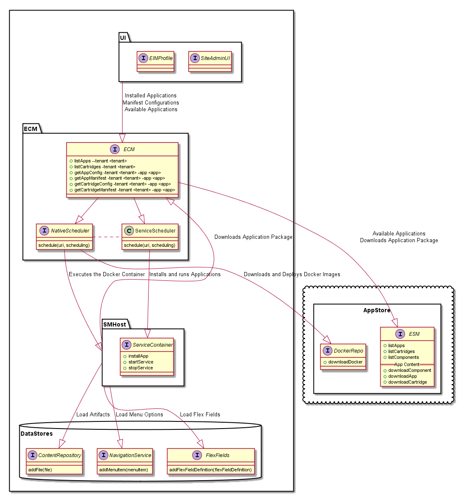
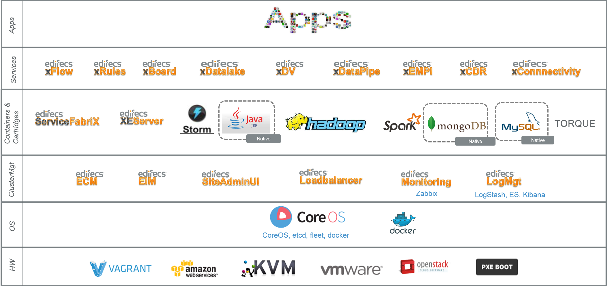

# ServiceManager/ApplicationFactory PaaS/ECM Integration

Integration points of SM into PaaS and ECM.

  * [App Deployment to EAS](EASAppDeployment.md)
  
    How are application zip packages dockerized and deployed to the EAS.
  
  * [Manifest.yaml File](Manifest.md)
  
    Details of the Manifest.yaml file used for SM as well as ECM for deployment.
  
  * [ECM Service Scheduler](SMMetaScheduler.md)
  
    How to use the Service Scheduler, and its design.
  
  * [Lifecycle Events](sm-lifecycle-api/README.md)
  
    Lifecycle events are bits of logic executed at specific times during the lifetime of an application. Such as app
    Installation on the cluster or for a specific tenant. These can be simple shell scripts, or complex java logic.

  * Cluster Manager Provider Interfaces
  
    * [EAS/App Store Interface](AppStore.md)
    
      How applications listed, searched, configured and installed.
    
    * [Metric/Performance Reporting Interface](MetricReporting.md)
    
      Viewing metric information about the performance. For ECM, this pulls from Zabbix, however it is configurable
      to pull from other sources as well. 
    
    * [Log/Audit Reporting Interface](LogReporting.md)
    
      Viewing and accessing log information interface. This pulls from LogStash/Kibanna/ElasticSearch when deployed by
      ECM, but is configurable to multiple solutions.

## Example Implementations of Apps integration with ECM

  * [ESM](../../esm/docs/ecm_integration.md)
  
  * [XBoard](../../xboard/docs/ecm_integration.md)
  
  * [Hello World Example](../../examples/hello-example/docs/ecm_integration.md)

## Interaction, Interfaces and responsibility between components

## Application Technology Stack

