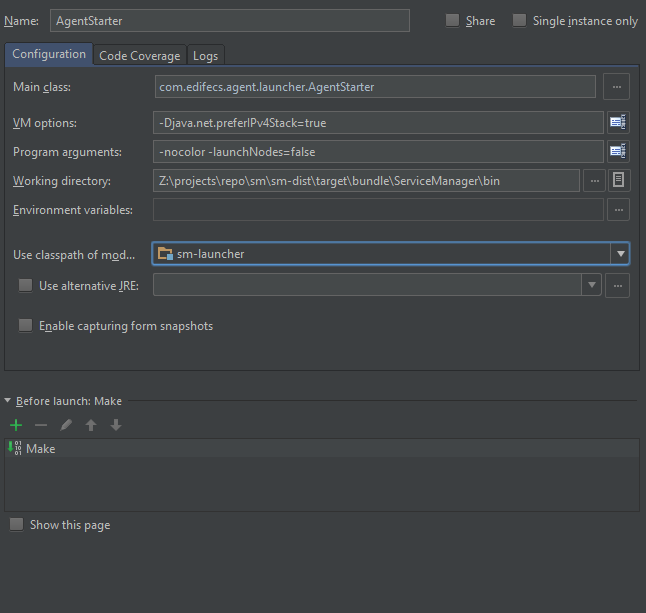
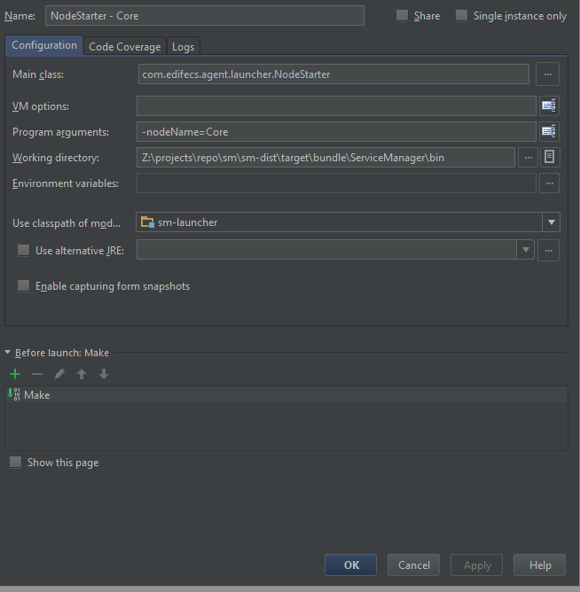

# IntelliJ Development

The easiest way to launch SM from an IDE is to include the sm-launcher dependency into one of your projects and configure the run configurations below

Maven `sm-launcher` Dependency Information:

    <dependency>
      <groupId>com.edifecs.epp</groupId>
      <artifactId>sm-launcher</artifactId>
      <version>1.6.0.0-SNAPSHOT</version>
    </dependency>

Agent only startup

Launching a Node

