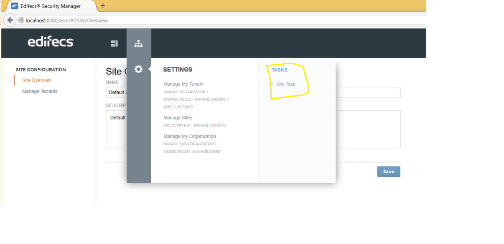

# XBar
A common header bar customisable at the site, tenant, and user levels.

## Settings
Clicking the home button on the doormat brings the user to the Settings screen.

  * Manage Site
  * [Manage My Tenant](docs/ManageMyTenant.md)
  * Manage My Organization
  
## Menu Navigation
Doormat item menus are specified by a developer editable JSON file.  Items are sorted first by 
weigh, if specified, and then alphabetically.  The following is a snippet of an example nav.json:

    {
        "service": "Security Service",
        "id":      "settings",
        "name":    "Settings",
        "columnOne": [
            {
                "namespace": "security",
                "weight":     99,
                "id":        "4-siteconfiguration",
                "text":      "Manage Sitesssssssss",
                "linkUrl":   "/esm/#!/Site/Overview", 
                "permission": "platform:security:administrative:site:view",
                "subMenu": [
                    {
                        "text": "Site Overview",
                        "linkUrl": "/esm/#!/Site/Overview", 
                        "id": "siteOverview" 
                    },
                    {
                        "text": "Manage Tenants",
                        "linkUrl": "/esm/#!/Site/ManageTenants",  
                        "id": "manageTenants"
                    }
                ]
            },
            {
                "namespace": "security",
                "id":        "5-tenantconfiguration",
                "text":      "Manage My Tenant",
                "linkUrl":   "/esm/#!/ManageTenant",
                "permission": "platform:security:administrative:tenant:view",
                "subMenu": [
                    {
                        "text": "Manage Organization",
                        "linkUrl":   "/esm/#!/ManageOrganization",
                        "id": "manageOrganization"
                    }
                ]
            },
            {
                "namespace": "security",
                "id":        "6-organizationconfiguration",
                "weight":     1,
                "text":      "Manage My Organization",
                "linkUrl":   "/esm/#!/ManageMyOrganization",
                "permission": "platform:security:administrative:organization:view",
                "subMenu": [
                    {
                        "text": "Manage Sub-Organization",
                        "linkUrl":   "/esm/#!/ManageSubOrganization",
                        "id": "manageSubOrganization"
                    }
                ]
            }
    
    
        ]
    }

## Tasks

Navigation menu can display the tasks by using this configuration in nav.json

    {
        "service": "Security Service",
        "id":      "settings",
        "name":    "Settings",
        "columnOne": [
            {
                "namespace": "security",
                "id":        "4-siteconfiguration",
                "text":      "Manage Sites",
            "weight":    1,
                "linkUrl":   "/esm/#!/Site/Overview",
                "permission": "platform:security:administrative:site:view",
                "subMenu": [
                    {
                        "text": "Site Overview",
                        "linkUrl": "/esm/#!/Site/Overview",
                        "id": "siteOverview"
                    },
                    {
                        "text": "Manage Tenants",
                        "linkUrl": "/esm/#!/Site/ManageTenants",
                        "id": "manageTenants"
                    }
                ]
            },
            {
                "namespace": "security",
                "id":        "5-tenantconfiguration",
                "text":      "Manage My Tenant",
            "weight":     2,
                "linkUrl":   "/esm/#!/ManageTenant",
                "permission": "platform:security:administrative:tenant:view",
                "subMenu": [
                    {
                        "text": "Manage Organization",
                        "linkUrl":   "/esm/#!/ManageOrganization",
                        "id": "manageOrganization"
                    },
                    {
                        "text": "Manage Roles",
                        "linkUrl":   "/esm/#!/ManageRoles",
                        "id": "manageRoles"
                    },
                    {
                        "text": "Manage Groups",
                        "linkUrl":   "/esm/#!/ManageGroups",
                        "id": "manageGroups"
                    },
                    {
                        "text": "Apps",
                        "linkUrl":   "/esm/#!/Apps",
                        "id": "manageTenantApps"
                    },
                    {
                        "text": "Settings",
                        "linkUrl":   "/esm/#!/Settings",
                        "id": "manageTenantSettings"
                    }
                    
                ]
            },
            {
                "namespace": "security",
                "id":        "6-organizationconfiguration",
                "text":      "Manage My Organization",
                "linkUrl":   "/esm/#!/ManageMyOrganization",
                "permission": "platform:security:administrative:organization:view",
                "subMenu": [
                    {
                        "text": "Manage Sub-Organization",
                        "linkUrl":   "/esm/#!/ManageSubOrganization",
                        "id": "manageSubOrganization"
                    },
                    {
                        "text": "Assign Roles",
                        "linkUrl":   "/esm/#!/AssignRoles",
                        "id": "assignRoles"
                    },
                    {
                        "text": "Manage Users",
                        "linkUrl":   "/esm/#!/ManageUsers",
                        "id": "manageUsers"
                    }
                ]
            }
    
        ],
         "tasks": [
                {
                "namespace": "security task",
                "id":        "15-siteconfiguration",
                "text":      "Site Task",
                "weight":    1,
                "linkUrl":   "/esm/#!/Site/Overview",
                "permission": "platform:security:administrative:site:view",
                "subMenu": [
                    {
                        "text": "Get Site Overview",
                        "linkUrl": "/esm/#!/Site/Overview",
                        "id": "siteOverview"
                    }
                ]
            }
            ]
    }

 
